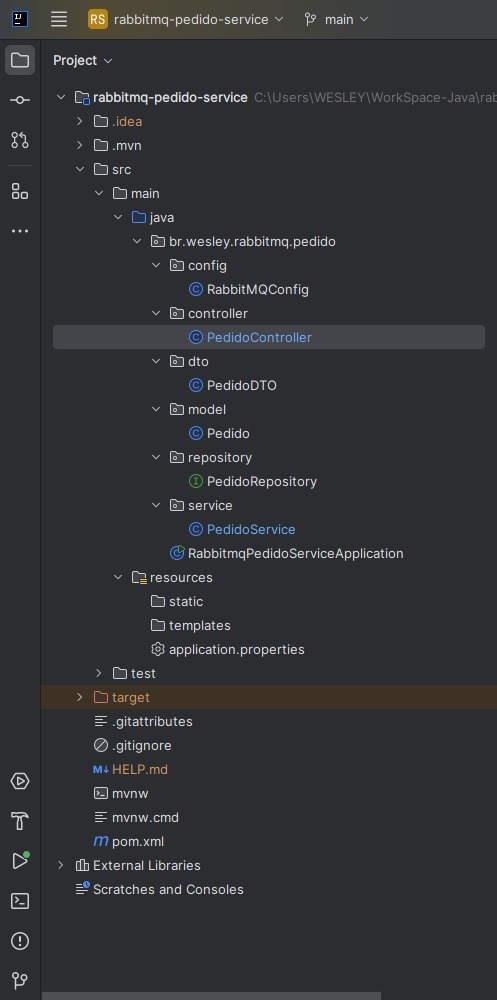
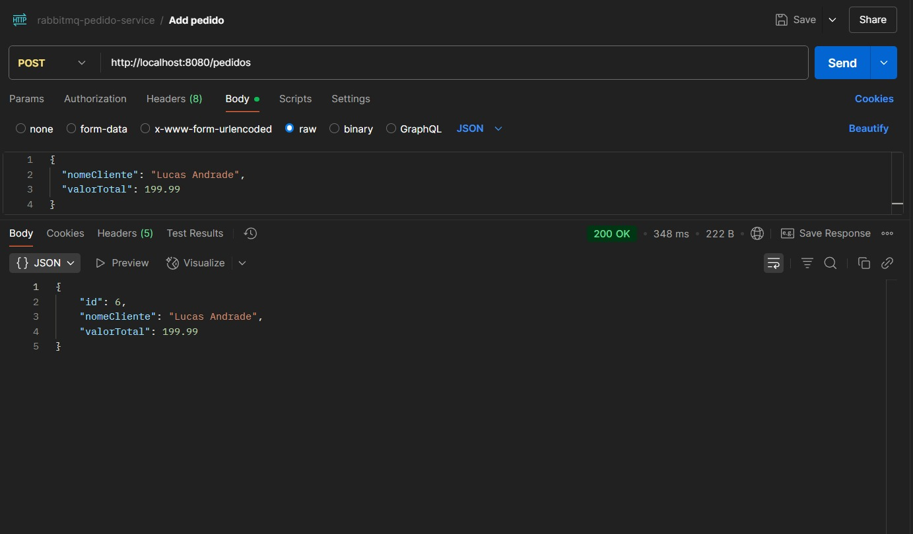
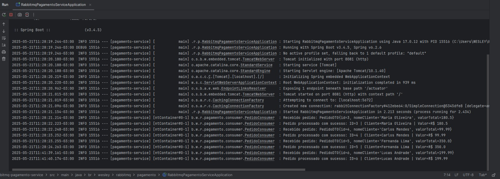
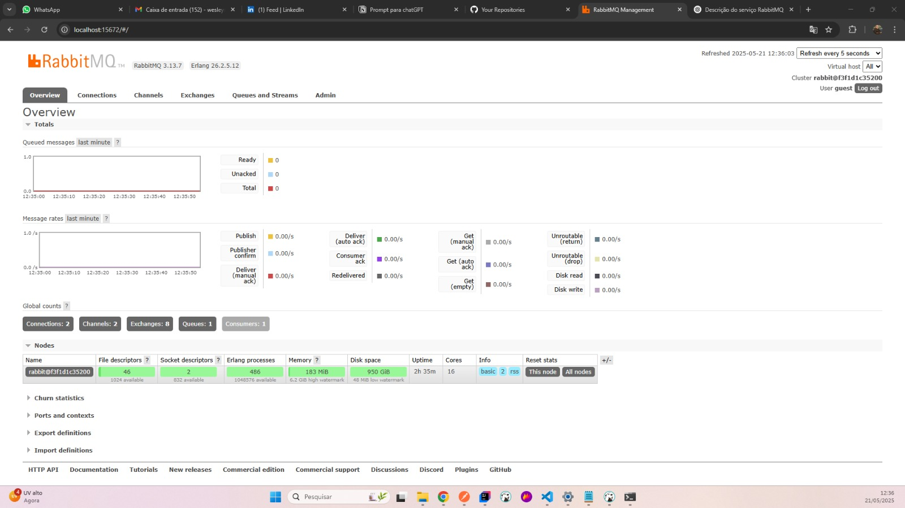
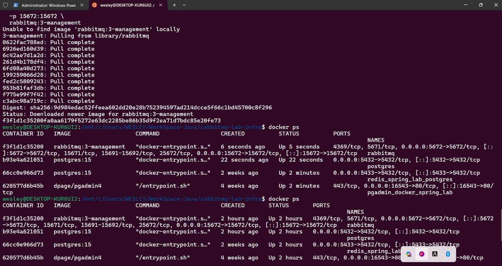
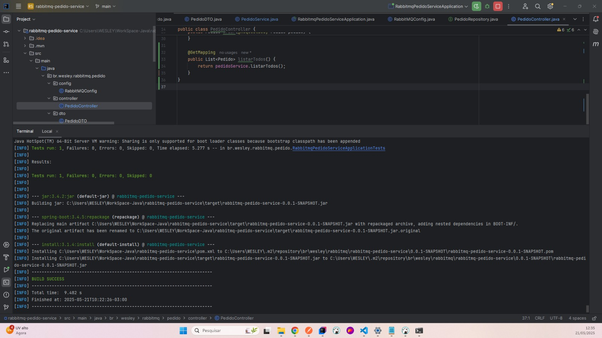
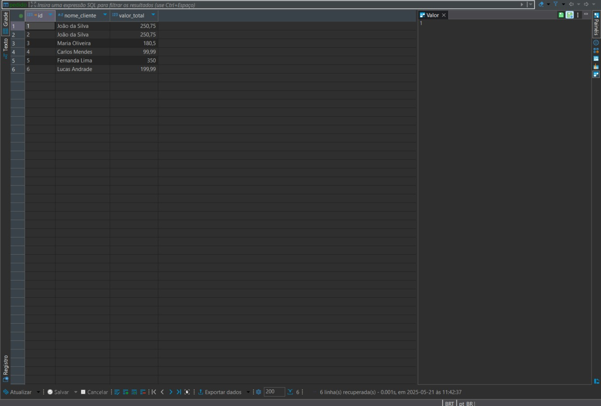

# Sistema de Pedidos com Processamento Assíncrono via RabbitMQ 🐇

Este projeto didático que simula um cenário real de pedidos e pagamentos utilizando uma arquitetura baseada em microsserviços com **mensageria assíncrona** através do **RabbitMQ**. 
É ideal para demonstrar conhecimento prático em integração entre sistemas desacoplados.

---

## 🧱 Arquitetura do Projeto

O sistema é composto por **3 partes distintas**, organizadas em repositórios separados:

| Projeto                      | Descrição                                                                 |
|-----------------------------|---------------------------------------------------------------------------|
| `rabbitmq-pedido-service`   | Microsserviço responsável por **receber pedidos** e **enviá-los ao RabbitMQ** |
| `rabbitmq-pagamento-service`| Microsserviço responsável por **consumir os pedidos da fila** e **simular o pagamento** |
| `rabbitmq-lab-infra`        | Ambiente com **RabbitMQ** e **PostgreSQL** via Docker Compose              |

---

### Estrutura do projeto:


---
## 📦 rabbitmq-pedido-service

### O que faz:
- Recebe requisições HTTP com dados de pedido (cliente + valor)
- Persiste o pedido no PostgreSQL
- Envia o objeto serializado (JSON) para a fila `pagamento.pedido` no RabbitMQ

### Exemplo de requisição:
```http
POST http://localhost:8080/pedidos
Content-Type: application/json

{
  "nomeCliente": "Maria Oliveira",
  "valorTotal": 180.50
}
```

### Imagem no Postman:


---

## 📬 rabbitmq-pagamento-service

### O que faz:
- Escuta a fila `pagamento.pedido`
- Converte a mensagem JSON recebida em um objeto Java (DTO)
- Simula o processamento do pagamento
- Exibe logs do processamento

### Exemplo de log:
```
Recebido pedido: ID=3 | Cliente=Maria Oliveira | Valor=R$ 180.5
Pedido processado com sucesso
```

### Visualização dos logs:


---

## ⚙️ rabbitmq-lab-infra (Docker Compose)

### O que contém:
- Container com **PostgreSQL** na porta 5432
- Container com **RabbitMQ + painel de administração** na porta 15672

### Comando para iniciar o ambiente:
```bash
cd rabbitmq-lab-infra
docker-compose up -d
```

### Painel do RabbitMQ:


---

## 🧪 Como testar o projeto completo

Este passo-a-passo é ideal para quem está começando ou quer entender como microsserviços funcionam em conjunto. Seguindo essas etapas, você conseguirá rodar todo o sistema localmente, testar o envio e consumo de mensagens, e visualizar os dados nos logs e no banco.

### 1. Clonando os repositórios
Clone os 3 repositórios individualmente no seu ambiente local:
```bash
git clone https://github.com/wesleymrosa/rabbitmq-lab-infra.git
cd rabbitmq-lab-infra

# Em outro terminal ou nova aba
cd ..
git clone https://github.com/wesleymrosa/rabbitmq-pedido-service.git

# Em outra aba ou terminal
cd ..
git clone https://github.com/wesleymrosa/rabbitmq-pagamento-service.git
```

### 2. Subindo os containers do RabbitMQ e PostgreSQL
```bash
cd rabbitmq-lab-infra
docker-compose up -d
```


### 3. Iniciando o serviço de pedidos
```bash
cd rabbitmq-pedido-service
mvn spring-boot:run
```


### 4. Enviando um pedido pelo Postman
Use o Postman para enviar a seguinte requisição:
```json
POST http://localhost:8080/pedidos
{
  "nomeCliente": "Lucas Andrade",
  "valorTotal": 199.99
}
```

### 5. Iniciando o serviço de pagamento
```bash
cd rabbitmq-pagamento-service
mvn spring-boot:run
```


### 6. Validando resultados
- **RabbitMQ**: acesse [http://localhost:15672](http://localhost:15672) (usuário/senha: guest/guest)
- **Logs**: observe os logs do consumidor processando a mensagem
- **Banco de Dados**: conecte com pgAdmin ou DBeaver e confira os pedidos na tabela

📸 Imagens:
- 
- 
- 

---

## 🗂️ Estrutura das Filas no RabbitMQ

- **Exchange**: `pagamento.direct` (tipo: `direct`)
- **Fila**: `pagamento.pedido`
- **Routing Key**: `pagamento.pedido`

---

## ✅ Conclusão

Esse projeto mostra na prática como **desacoplar sistemas** usando **mensageria assíncrona**, otimizando a comunicação entre microsserviços e promovendo **resiliência**, **escalabilidade** e **isolamento de falhas**.

Ideal para uso em portfólio profissional, entrevistas técnicas e provas de conceito.

---

## 👤 Autor

**Wesley Martins Rosa**  
📧 Email: [wesleymrosa@gmail.com](mailto:wesleymrosa@gmail.com)  
🐱 GitHub: [github.com/wesleymrosa](https://github.com/wesleymrosa)  
💼 LinkedIn: [linkedin.com/in/wesley-martins-rosa-5118aa15a](https://www.linkedin.com/in/wesley-martins-rosa-5118aa15a)

---

## 📅 Licença

Este projeto foi desenvolvido com fins **estritamente educacionais**.  
Sinta-se à vontade para **estudar, adaptar e aprimorar** conforme suas necessidades.  
Contribuições são bem-vindas!

---
